# Batch and stream data ingest platform report

### Introduction

**mysimbdp** Is a big data platform-as-a-service service offiering multi-tenancy, different data models and pay as you go. 

**mysimbdp-coredms:** A big data storage for mysimbdp to store and manage large datasets and its adaptability to unstructured and semi-structured data for different tenants and different models. MongoDB is the preferred Backend Database Management System (BDMS).

**Batch data ingestion pipeline:** mysimbdp-batch-dataingest reads data (.csv files) from tenants placing in the platform's **staging-input-directory** as the source and employs Apache Kafka and Apache Spark as the messaging and processing system along with batch data ingest app (developed with python technology) for ingestion.

**Near real-time data ingestion:** mysimbdp-real-time-dataingest reads stream data as messages from tenants as they send to the platform's messaging system which is the source of data and employs Apache Kafka and Apache Spark as the messaging and processing system along with stream data ingest app (developed with python technology) for real-time data ingestion.

**mysimbdp-daas:** mysimbdp provides APIs for external data producers and consumers, in this context for example MongoDB Compass act as mysimbdp-daas so that it can use mysimbdp-coredms from user level.

### Part 1 - Batch data ingestion pipeline

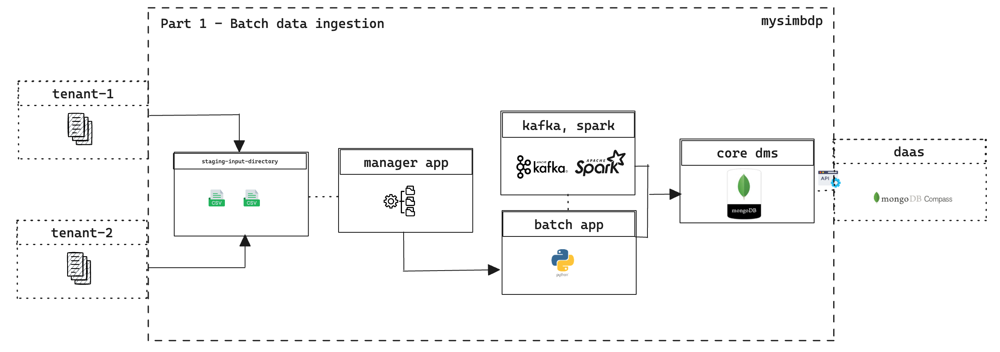
*Figure 1 : part 1 - mysimbdp*


>**1.** The ingestion will be applied to files of data. Design a schema for a set of constraints for data files that mysimbdp will support the ingestion. Design a schema for a set of constraints for tenant service agreement. Explain why you, as a platform provider, decide such constraints. Implement these constraints into simple configuration files. Provide two examples (e.g., JSON or YAML) for two different tenants to specify constraints on service agreement and files for the tenant. (1 point)

As the batch data ingetion pipeline, it will accept data files as `CSV`format from all its tenants. Considering platform's efficiency and tenancy services, agrrements and pay-as-go model, below is 2 example for 2 tenancy constraints - 

```
  file-format: csv
  file-header: true
  file-size: 7000000 
  file-name-prefix: reviews
  header-structure: listing_id,
                    id,date,
                    reviewer_id,
                    reviewer_name,
                    comments
```

*Figure 2.1 : tenant-1 constraints*


```
  file-format: csv
  file-header: true
  file-size: 7000000 
  file-name-prefix: ruuvitag
  header-structure: time,
                    readable_time,
                    acceleration,
                    acceleration_x,
                    acceleration_y,
                    acceleration_z,
                    battery,humidity,
                    pressure,
                    temperature,
                    dev-id
```

*Figure 2.2 : tenant-2 constraints*

In figure 1 & 2 constraints shows the data file format, data file naming convention, data structures and data size each time. All these also considered for the service agreement as the tenant profile as pay-as-go. A necessary header and CSV file format ensure compatibility and data integrity on the platform. File sizes must be limited to 7,000,000 bytes to maintain pay-as-go profile according to resource load and scalability.  Organising and identifying tenants with file name prefixes. Defining a structured header improves data processing and consistency. 

> **2.** Each tenant will put the tenant's data files to be ingested into a staging file directory (or a storage bucket), client-staging-input-directory within mysimbdp (the staging directory is managed by the platform). Each tenant provides its ingestion programs/pipelines, clientbatchingestapp, which will take the tenant's files as input, in client-staging-input-directory, and ingest the files into mysimbdp-coredms. Any clientbatchingestapp must perform at least one type of data wrangling to transform data elements in files to another structure for ingestion. As a tenant, explain the design of clientbatchingestapp and provide one implementation. Note that clientbatchingestapp follows the guideline of mysimbdp given in the next Point 3. (1 point)

We will use kafka and spark together to provide batch ingestion, which will be at  the same time same time work along with tenants app. Kafka will produce message from the data file and pass to spark for further process and store as batch at once to coredms in our case mongoDB shard culters. In coredms we used sharding and hashed indexing for better performance. 

Each tenants will stage their data file following t he tenant profile constraints to the platform's **input-staging-directory** which is common for all tenats and **client-batch-ingest-app** will be in place to handle data ingestion on data files in the staging directory to process and store in the coredms. 

**client-batch-ingest-app** will also do data wrangling for both tenants provided data to a new data structure for efficiency and easy future use of data. For example, tenant-1 provided data has 3 different type of similar data column `listing_id`, ` id`, and `reviewer_id`. For future easy use we will concanate 3 elements to 1 as `listing_id_id_reviewer_id`. 

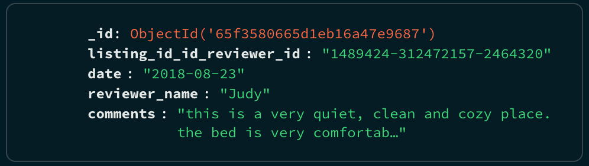
*Figure 3.1 : tenant-1 data after transformation*

Also, for tenant-2 provided data has a machine geberated `time` column which has very low use case for the tenant as there is another human `readable_time` column too. For future easy use we will remove `time`column and keep only human `readable_time` as the new `time`column. 

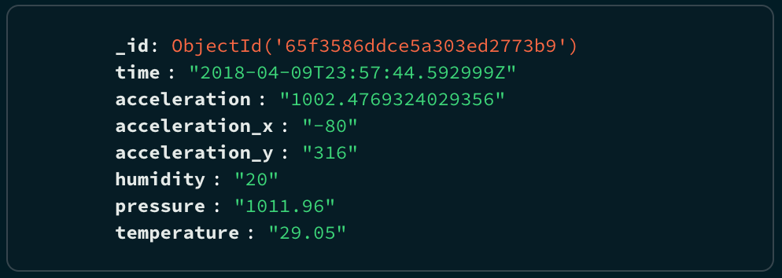
*Figure 5 : tenant-2 data after transformation*

**client-batch-ingest-app** is part of the platform, we designed and implemented it as the tenants profile agreements, so that it can handle and follow the constraints of each teanants. It will read each tenant's `CSV`data and after required transformation of data it will write as `JSON`data structure to coredms for dedicated database for the as tenant profile/ service agreements.

>**3.** The mysimbdp provider provisions an execution environment for running tenant's ingestion pipelines (clientbatchingestapp). As the mysimbdp provider, design and implement a component mysimbdp-batchingestmanager that invokes tenant's clientbatchingestapp to perform the ingestion for available files in client-staging-input-directory. mysimbdp imposes the model that clientbatchingestapp has to follow but clientbatchingestapp is, in principle, a blackbox to mysimbdp-batchingestmanager. Explain how mysimbdp-batchingestmanager knows the list of clientbatchingestapp and decides/schedules the execution of clientbatchingestapp for different tenants. (1 point)

 This big data platform provider, **mysimbdp-batch-ingest-manage** is the single component that a pipeline admin will invoke to start the pipeline. It will keep watching the **staging-inpur-directory** of the platform which is the data primary data bucket for all tenants, and will perform data ingestion on all available files based on the tenats profile. All component of the platform are isolated from all users. 

**batch-ingest-manager** will follow First-In-First-Out (FIFO)
scheduling methods to process all data files in the **staging-input-directory**. **batch-ingest-manager** implemented such way , that based on the datafiles and tenants profile it will invoke the dedicated **client-ingest-app** for each tenant. Ingest manager will also a housekeeping job by generating a new file name adding `timestamp`with the original name and archiving all processed file to a different directory named `processed`. 

As the batch ingestion job and FIFO method each component will use full resource capacity for the job as it will be more effieient to utilize resources. 

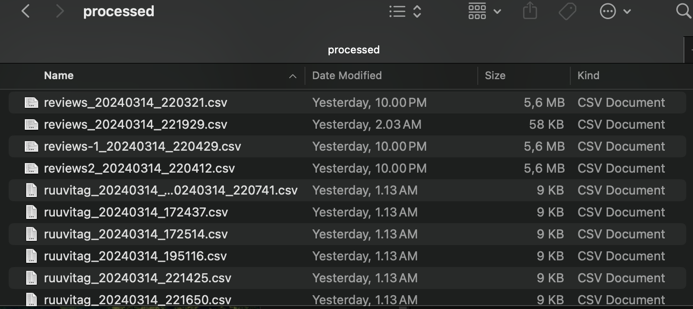
*Figure 4 : processed directory archive*

>**4.** Explain your design for the multi-tenancy model in mysimbdp: which parts of mysimbdp will be shared for all tenants, which parts will be dedicated for individual tenants so that you, as a platform provider, can add and remove tenants based on the principle of pay-per-use. Develop test clientbatchingestapp, test data, and test constraints of files, and test service profiles for tenants according to your deployment. Show the performance of ingestion tests, including failures and exceptions, for 2 different tenants in your test environment and constraints. Demonstrate examples in which data will not be ingested due to a violation of constraints. Present and discuss the maximum amount of data per second you can ingest in your tests. (1 point)

>Tenant-1 Data Source: We used customer reviews data in tests for tenant-1 and the structures are as defined in the consraints. 
[Airbnb Customer Reviews Data](http://insideairbnb.com/get-the-data/)

>Tenant-2 Data Source: We used tortoise monitoring data in tests for tenant-2 and the structures are as defined in the consraints. 
[Tortoise monitoring in Korkeasaari zoo](https://iot.fvh.fi/downloads/tortoise/)

**mysimbdp** is multi-tenantcy compatible and easy scalable for mpore tenants. It can be scaled up for tenants and can adopt different pricing model for each tenants applying different constraints and increase dedicated components only. 

Following are the shared components of the **mysimbdp** for all its tenats - 

- **staging-input-directory**
- **batch-ingest-manager** 
- **coredms**

Below are the dedicated components for each tenants as the tenancy profile and services - 

- **client-batch-ingest-app**
- **database** 

About 600 individual rows / documents ingested per second in a test phase of batch data ingestion. Platform follow strictly data constraints for each tenants, in the test phase, we provieded invalid dta file and it notify that does not meet specified constraints. 

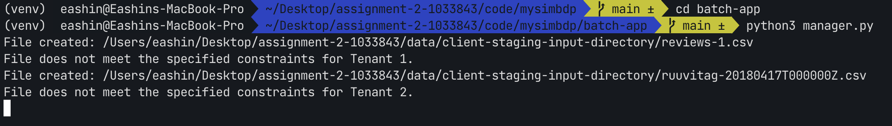
*Figure 5 : processed directory archive*

>**5.** Implement and provide logging features for capturing successful/failed ingestion as well as metrics about ingestion time, data size, etc., for files which have been ingested into mysimbdp. Logging information must be stored in separate files, databases or a monitoring system for analytics of ingestion. Explain how mysimbdp could use such logging information. Show and explain simple statistical data extracted from logs for individual tenants and for the whole platform with your tests.(1 point)

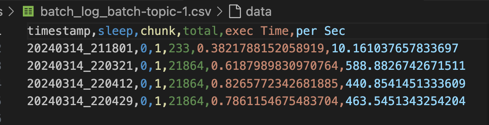
*Figure 6 : processed directory archive*


A sophisticated logging feature for each tenant is in place to analyse in future use of all logged metrics. All tenant's log files are saved in `logs` directory. 

Metrics like execution time and processing speed are tracked to assist measure the effectiveness of data processing processes. Metrics like data chunk sizes and the total number of records processed can be used to analyse resource utilisation.  

Platform can plan for scalability, streamline operations, troubleshoot, data process speeds up, and service delivery by utilising this logging data.

This log may useful to tenant-specific research and understand the data input and relevant patterns. 

### Part 2 - Near real-time data ingestion

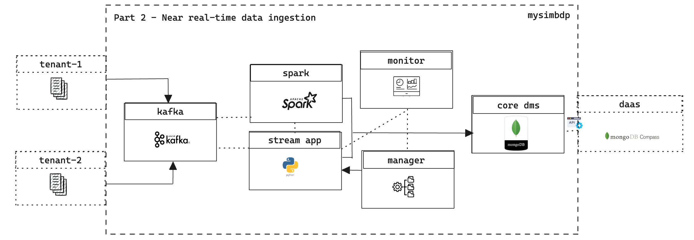
*Figure 1 : part 2 - mysimbdp*

> **1.** Tenants will put their data into messages and send the messages to a messaging system. mysimbdp messagingsystem (provisioned by mysimbdp) and tenants will develop ingestion programs, clientstreamingestapp, which read data from the messaging system and ingest the data into mysimbdp-coredms. For near real-time ingestion, explain your design for the multi-tenancy model in mysimbdp: which parts of the mysimbdp will be shared for all tenants, which parts will be dedicated for individual tenants so that mysimbdp can add and remove tenants based on the principle of payper-use. (1 point)

As the platform's near real-time streaming services each teanats will publish data / messages to the kafka broker which will serve as mysimbdp messagingsystem and this will be provisiioned and maintain by platform as part of a streaming ingestion services. 

We will use kafka as a message broker and spark will consume messages from kafka to provide further transformation stream ingestion, which will be used by tenants app, tenants app will work along with kafka and spark. Kafka will produce message from the data file and pass to spark for further process and store as batch at once to coredms in our case mongoDB shard culters. In coredms we used sharding and hashed indexing for better performance. 

This near real-time streaming is compatible for multi-tenancy and scalability as it will stream data as per tenacy agreement and several applicable constraints and rules to apply for each tenant's profile. For example, we apply different tenancy models similarly like batch ingestion.

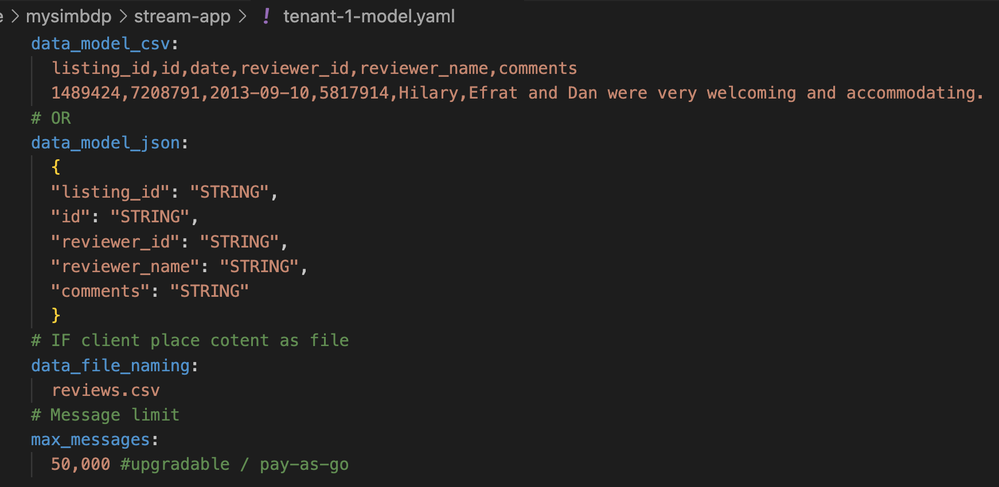
*Figure 2.1 : tenant-1 service and constaints*

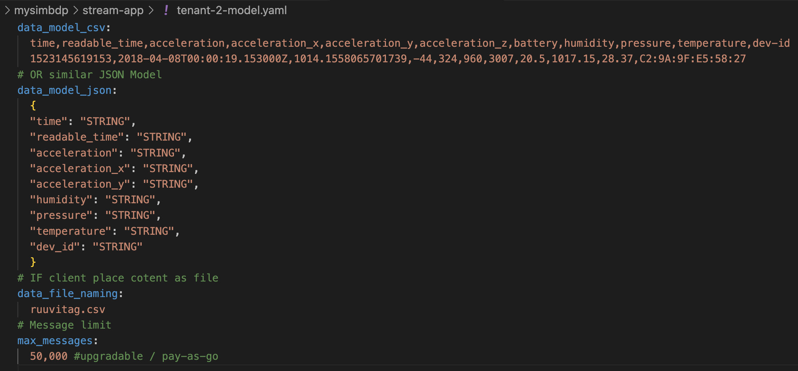
*Figure 2.2 : tenant-2 service and constaints*

All tenants must follow data/ messaging model and other profile constraints to use services of near real-time stream data ingestion.Following are the shared components of the **mysimbdp** for all its tenats - 

- **message-brokage-sysmtem** In our case kafka and spark as the message broker and consumer. 
- **stream-ingest-manager** In our case the same component provided to each tenant to use. In a sense its shared but tenants specific too.
- **stream-ingest-monitor** Also same as the manager component.
- **coredms**

Below are the dedicated components for each tenants as the tenancy profile and services - 

- **client-stream-ingest-app**
- **database** 

> **2.** Design and implement a component mysimbdp-streamingestmanager, which can start and stop clientstreamingestapp instances on-demand. mysimbdp imposes the model that clientstreamingestapp has to follow so that mysimbdp-streamingestmanager can invoke clientstreamingestapp as a blackbox. Explain the model w.r.t. steps and what the tenant has to do in order to write clientstreamingestapp. (1 point)

**stream-ingest-manger** is implemented and designed to used as the single component to a user of platform or tenant which will be the interface to start and stop the stream-ingest-app on demand but once it start as the stream nature it will be activated and running till it stop by the users. To use the stream-ingest-app along with the stream-manager, ithas to follow same constraints and model defied previously for the data and limitations as per tenant's profile. 

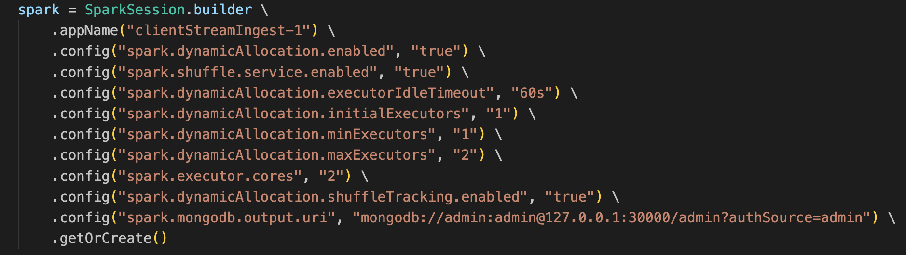
*Figure 3 : dynamic resource allocation*

**client-stream-ingest-app** should be developed such way that can handle concurrent execution meaning on demand dynamic resource sharing and indefinate preiod of runnning capacity. To develop stream-ingest-app it shoud be the priority to handle concurrency, optimize resurce allocation, low data input frequency Or idle time (so part of pipeline even can be stopped to save cost without losing data). 

> **3.** Develop test ingestion programs (clientstreamingestapp), which must include one type of data wrangling (transforming the received message to a new structure). Show the performance of ingestion tests, including failures and exceptions, for at least 2 different tenants in your test environment. Explain the data used for testing. (1 point)

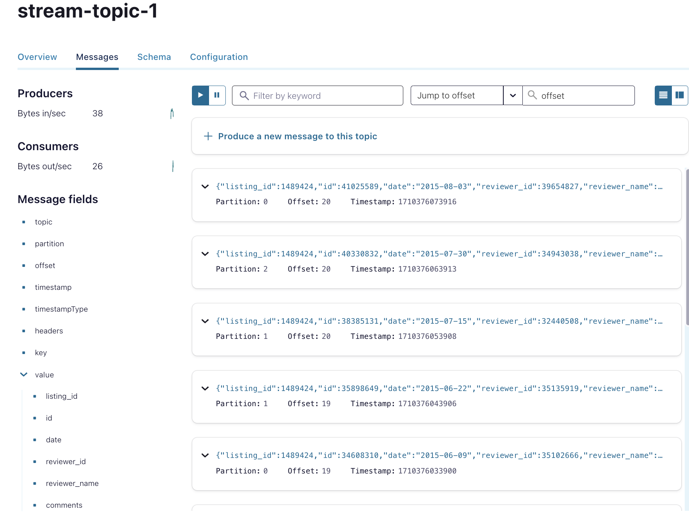
*Figure 4 : tenant-2 test log*

>Tenant-1 Data Source: We used customer reviews data in tests for tenant-1 and the structures are as defined in the consraints. 
[Airbnb Customer Reviews Data](http://insideairbnb.com/get-the-data/)

>Tenant-2 Data Source: We used tortoise monitoring data in tests for tenant-2 and the structures are as defined in the consraints. 
[Tortoise monitoring in Korkeasaari zoo](https://iot.fvh.fi/downloads/tortoise/)

We also have similar logging to further analyse the stream-ingestion metrics - 

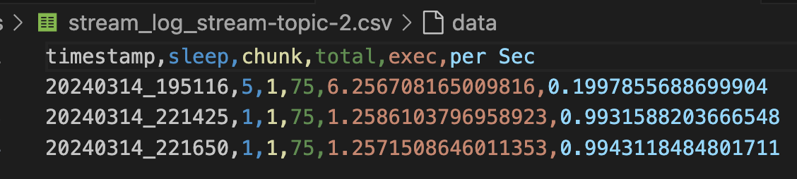
*Figure 5.1 : tenant-2 test log*

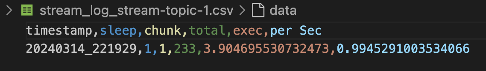
*Figure 5.2 : tenant-2 test log*

**client-batch-ingest-app** will also do data wrangling for both tenants provided data to a new data structure for efficiency and easy future use of data. For example, tenant-1 provided data has 3 different type of similar data column `listing_id`, ` id`, and `reviewer_id`. For future easy use we will concanate 3 elements to 1 as `listing_id_id_reviewer_id`. 


*Figure 6.1 : tenant-1 data after transformation*

Also, for tenant-2 provided data has a machine geberated `time` column which has very low use case for the tenant as there is another human `readable_time` column too. For future easy use we will remove `time`column and keep only human `readable_time` as the new `time`column. 


*Figure 6.2 : tenant-2 data after transformation*


> **4.** clientstreamingestapp decides to report its processing rate, including average ingestion time, total ingestion data size, and number of messages to mysimbdp-streamingestmonitor within a predefined period of time. Design the report format and explain possible components, flows and the mechanism for reporting. (1 point)

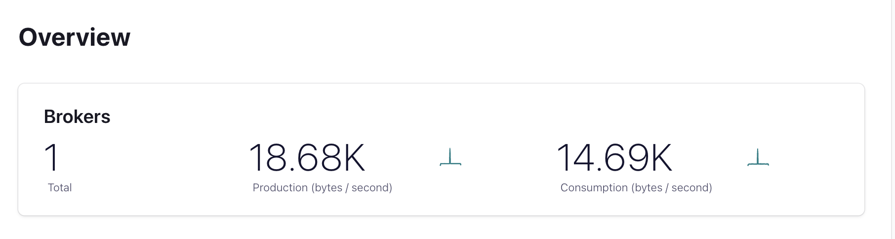
*Figure 7 : overview report*

clientstreamingestapp will provide reports bsed on generated stream-ingest-app log particularly processing rate as it is curucial to understand the idle time and message freequency to optimize resource uses. The application gathers metrics while processing data, creates reports on a regular basis. Tenant identifiers, metrics, and timestamps are included in the report format to enable tenant-specific analysis. For every tenant, this reporting system guarantees effective operation and performance monitoring of the almost real-time data input process.

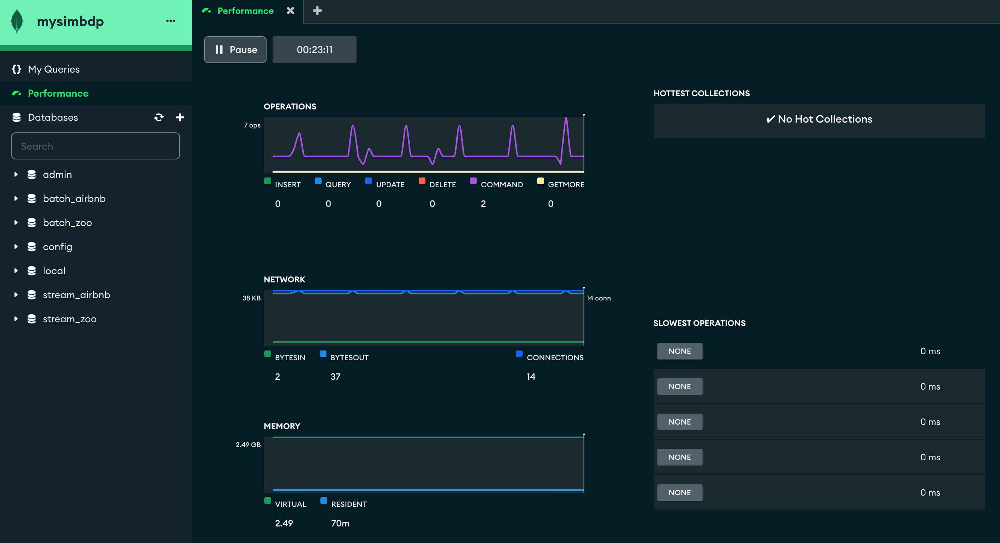
*Figure 8 : overview report*

> **5.** Implement a feature in mysimbdp-streamingestmonitor to receive the report from clientstreamingestapp. Based on the report from clientstreamingestapp, when the performance is below a threshold, e.g., average ingestion time is too low, mysimbdp-streamingestmonitor decides to inform mysimbdp-streamingestmanager about the situation. Implement a feature in mysimbdpstreamingestmanager to receive information informed by mysimbdp-streamingestmonitor. (1 point)

Kafka confluent and spark has many monitoring features which can be used to monitor many different metrics which can leverage many insightful analytics and may send those metrics to application running. 

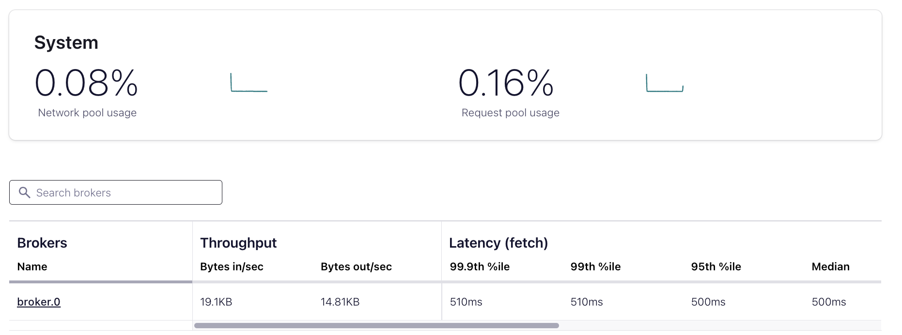
*Figure 9 : overview report*

### Part 3 - Integration and Extension

>**1.** Produce an integrated architecture, with a figure, for the logging and monitoring of both batch and near real-time ingestion features (Part 1, Point 5 and Part 2, Points 4-5). Explain how a platform provider could know the amount of data ingested and existing errors/performance for individual tenants. (1 point)

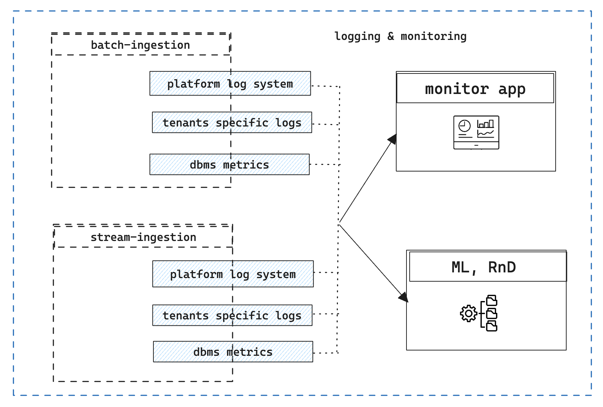
*Figure 1 : overview report*

At various ingestion phases, logs record execution timings, faults, and performance indicators. A centralised logging system makes these logs easier to access and analyse.

The integrated architecture for batch and near real-time ingestion uses both DBMS system monitoring features and bespoke components. This gives the platform provider complete data ingestion and database performance insights.

Integrated third-party monitoring apps offer advanced monitoring. These apps monitor batch and real-time pipeline log data for abnormalities, errors, and performance concerns.

Platform providers can track data intake and identify tenant faults and performance concerns using the integrated architecture.
Platform providers can optimise resources and comply with SLAs by analysing tenant-specific metrics and logs.

>**2.** In the stream ingestion pipeline, assume that a tenant has to ingest the same data but to different sinks, e.g., mybdp-coredms for storage and a new mybdp-streamdataprocessing component. What features/solutions can you provide and recommend to your tenant? (1 point)

**Kafka connector:** Allow tenants to configure stream ingestion pipeline connections. These connections can send ingested data to numerous destinations, such as mybdp-coredms for storage and mybdp-streamdataprocessing for processing.

**Sink multiplexing:** Add it to the stream ingestion pipeline. The tenant can setup several sinks for ingested data, and the pipeline automatically duplicates and routes the data to each sink.

>**3.** Assume that the tenant wants to protect the data during the ingestion by using some encryption mechanisms to encrypt data in files. Thus, clientbatchingestapp has to deal with encrypted data. Which features/solutions do you recommend to the tenants, and which services might you support for this goal? (1 point)

**Transport Layer Security (TLS):** Kafka and Spark can encrypt data pipeline node communication with TLS. TLS encrypts data between Kafka brokers, Spark nodes, and other components, preventing eavesdropping and tampering.

**Encryption at Rest:** File-level encryption or storage system encryption can safeguard data in Kafka topics or Spark data stores (e.g., HDFS). Encrypted data on disc prevents unauthorised access to sensitive information.

>**4.** In the case of near real-time ingestion, assume that we want to (i) detect the quality of data to ingest only data with a predefined quality of data and (ii) store the data quality detected into the platform. Given your implementation in Part 2, how would you suggest a design/change for achieving this goal? (1 point)

**mysimbdp-streamingestmonitor** should be improved to gather and track data quality parameters in real time. This comprises tracking the number of incoming data records, the quality of those, and any ingestion difficulties.

**Metadata** Store data quality metadata with ingested data in mybdp-coredms. Metadata for each data record should include quality scores, validation results, error messages, or quality flags.

>**5.** Assume a tenant has multiple clientbatchingestapp. Each is suitable for a type of data and has different workloads, such as complex transformation or feature engineering (e.g., different CPUs, memory consumption and execution time). How would you extend your design and implementation in Part 1 (only explain the concept/design) to support this requirement? (1 point)

**Dynamic Resource Allocation:** Mysimbdp-batchingestmanager allocates compute resources based on client app workload and resource demands. Includes CPU, memory, and execution. Kubernetes or Apache YARN can dynamically allocate resources and workload to multiple clientbatchingestapp instances.


